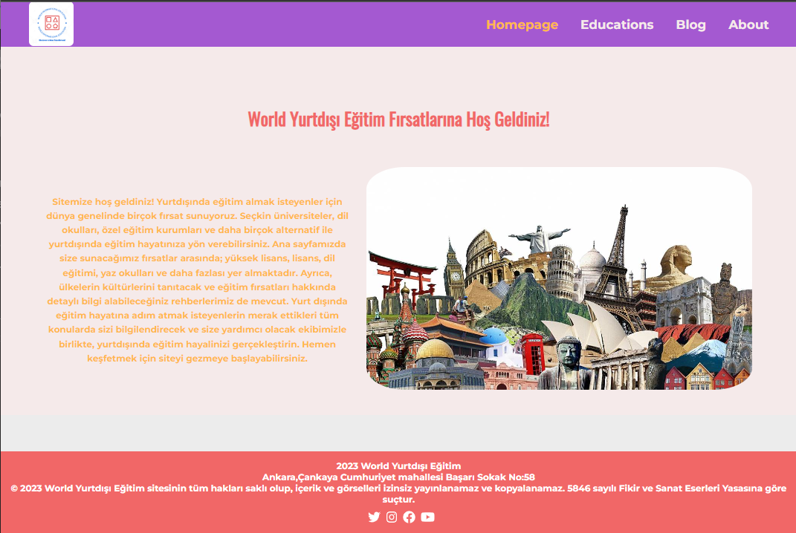
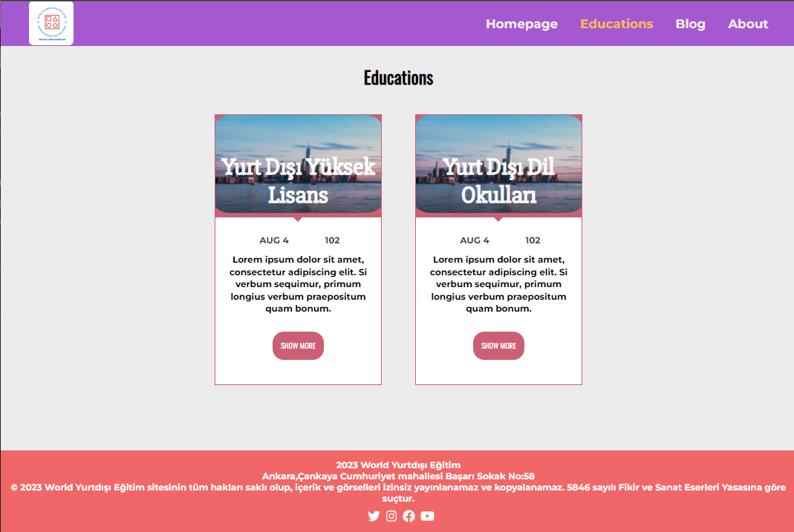
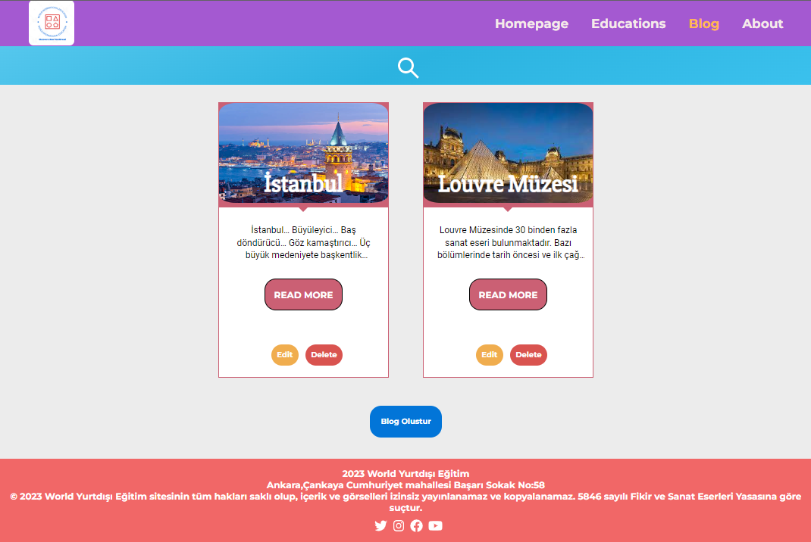

#  **WorldIntEdu.com**

Bu projede yurtdisina egitim görmek isteyen ögrenciler için acenta gorevini ustlenmis bir kurulusun websitesi yapilmistir.
Web Sayfasinda giden ogrencilerin deneyimlerini paylasabilmesi icin blog olusturulmustur.

- ***Orkun KARACA***
- ***Ahmet TOLAY***
- ***Alper PEKÖZER***
---
## Renk Referansı

| Renk             | Hex                                                                |
| ----------------- | ------------------------------------------------------------------ |
| Header-Footer Title |  #F5EAEA |
| Footer Back Ground  |  #F16767 |
| Home Page Paragraph |  #FFB84C |
| Header Back Ground  |   #A459D1 | 

---
## Site Fotoğrafları
 - ### Home Page
 

---
 - ### Educations
 

---
  - ### Blog
  
  
---

## Kullanılan Teknolojiler

**İstemci:** React, JavaScript, HTML, Css

**Sunucu:** Node, Axios

---

## Bağımlılıklar
- @fortawesome
- @testing-library
- axios
- react
- react-dom

  

  
